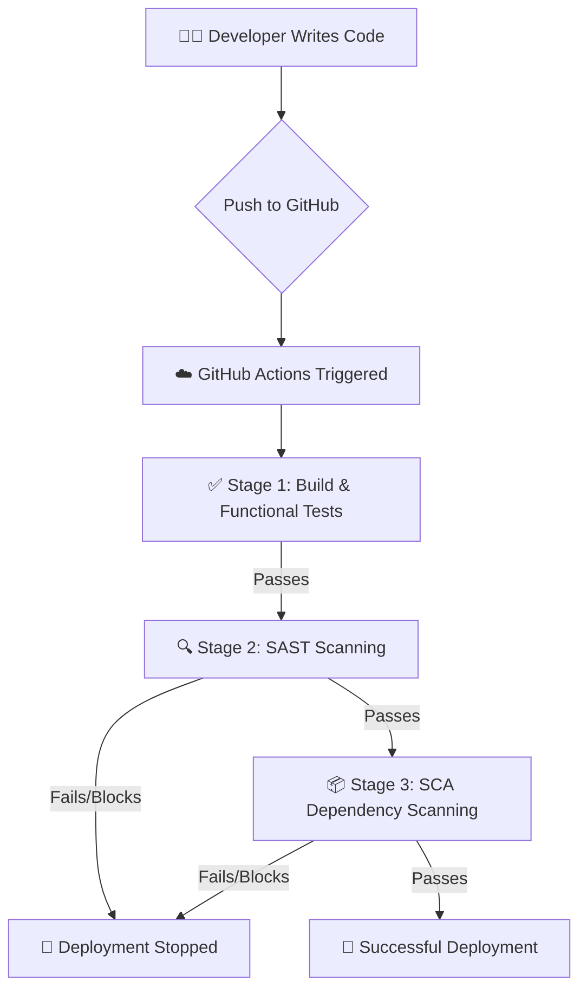

# 🛡️ Secure DevSecOps CI/CD Pipeline Implementation

> A complete integration of automated security gates directly into the development lifecycle, demonstrating the power of "Shifting Security Left."

---

## 1. 📖 Introduction
This project demonstrates the implementation of **DevSecOps** by integrating security directly into the Continuous Integration and Continuous Deployment (CI/CD) pipeline.

Traditionally, security is applied at the final stage of development, which leads to late detection of vulnerabilities and high remediation costs. This project solves that problem by implementing **Shift Left Security**, where vulnerabilities are detected early during development.

---

## 2. 💡 Core Concept
**DevSecOps combines:**
👨‍💻 **Development (Dev)** | 🔒 **Security (Sec)** | ⚙️ **Operations (Ops)**

The main idea is:
> **Security should be automated, continuous, and enforced—not manual or optional.**

In this project:
- 🔄 Every code push is **automatically scanned**
- 🛑 Vulnerable code is **blocked before deployment**

---

## 3. 🛤️ Workflow Overview (Journey of the Code)



#### Phase 1: Developer Stage (Local Environment)
The developer writes code using Python/Flask. A vulnerability is intentionally introduced, such as:
- 🔑 Hardcoded secret key
- 💣 Use of outdated/vulnerable library (e.g., `urllib3 1.25.8`)

The developer pushes code to GitHub:
```bash
git commit -m "update code"
git push
```
At this stage, no security validation has been applied yet.

#### Phase 2: CI/CD Pipeline Trigger
Once the code is pushed:
1. GitHub Actions automatically triggers the pipeline.
2. A temporary cloud-based environment (Ubuntu server) is created.
3. The workflow file (`devsecops.yml`) starts executing.

---

## 4. 🚧 Pipeline Stages (Security Gates)

### 🟢 Stage 1: Build & Functional Testing
- **Tool Used:** `pytest`
- **Purpose:** Verify that the application works correctly
- **Process:** Code is downloaded ➡️ Dependencies installed ➡️ Unit tests executed.
- **Result:** ✅ **PASS**
- **Explanation:** Even though the code contains vulnerabilities, it still works functionally.

### 🔴 Stage 2: SAST (Static Application Security Testing)
- **Tool Used:** Bandit
- **Purpose:** Analyze source code without executing it.
- **Process:** Scans Python files and detects insecure coding patterns.
- **Issues Detected:** Hardcoded secret key & SQL Injection vulnerability.
- **Result:** ❌ **FAIL**
- **Impact:** Pipeline stops execution. Deployment is blocked.

### 🔴 Stage 3: SCA (Software Composition Analysis)
- **Tool Used:** `pip-audit`
- **Purpose:** Scan third-party dependencies.
- **Process:** Reads `requirements.txt` checks packages against vulnerability databases.
- **Issues Detected:** `urllib3 1.25.8` is vulnerable. (*CVE-2020-26137*)
- **Result:** ❌ **FAIL**
- **Impact:** Deployment is blocked.

---

## 5. 🎯 Final Outcome
Because security checks failed:
- ❌ Deployment is blocked
- ❌ Code cannot reach production

**Developer Feedback:**
GitHub shows a Red ❌. Logs highlight the exact file, exact line, and exact vulnerability.

---

## 6. 🛠️ Fixing the Issues
To pass the pipeline, the developer must fix the flaws locally:

| 🛑 Problem | ✅ Solution |
|-------------|--------------|
| Hardcoded Secret | Use environment variables |
| SQL Injection | Use parameterized queries |
| Vulnerable Library | Update to a secure version |

After fixing, the code is pushed again. The pipeline re-runs and ✅ **All stages pass**.

---

## 7. 🔌 Pipeline Usage by Others

#### Method 1: Drop-In Method
Simply copy the `.github/workflows/devsecops.yml` file and paste it into any repository.
**Result:** Instant DevSecOps pipeline for that codebase!

#### Method 2: Reusable Workflow Method
Developers can reference this pipeline dynamically:
```yaml
uses: kryptbakar/Secure-DevSecOps-CI-CD-Pipeline-Implementation/.github/workflows/devsecops.yml@main
```
**Advantages:** Centralized control, easy universal updates, and highly scalable across teams.

---

## 8. 🏢 Real-World Importance
1. 💰 **Cost Reduction:** Early bug fixing is cheap; late bug fixing is expensive.
2. 📋 **Compliance Support:** Helps achieve SOC2, ISO 27001, and PCI-DSS.
3. ⚙️ **Automation:** Reduces manual checks and saves time for security teams.
4. ⛓️ **Supply Chain Protection:** Detects vulnerable third-party libraries.

---

## 10. 🎉 Conclusion & Key Takeaways
This project proves the effectiveness of DevSecOps by demonstrating how automated pipelines can enforce strict security policies. 

Instead of detecting vulnerabilities months later in an audit, the system **identifies issues instantly**, **blocks insecure code**, and **ensures only secure applications reach production**.

**Key Takeaways:**
- ✔️ DevSecOps integrates security into development
- ✔️ Shift Left Security detects issues early
- ✔️ CI/CD pipelines act as automated security gates
- ✔️ SAST scans code, SCA scans dependencies
- ✔️ Automation improves security and efficiency

> *"This pipeline acts as an automated security guard that prevents vulnerable code from ever reaching production."*
